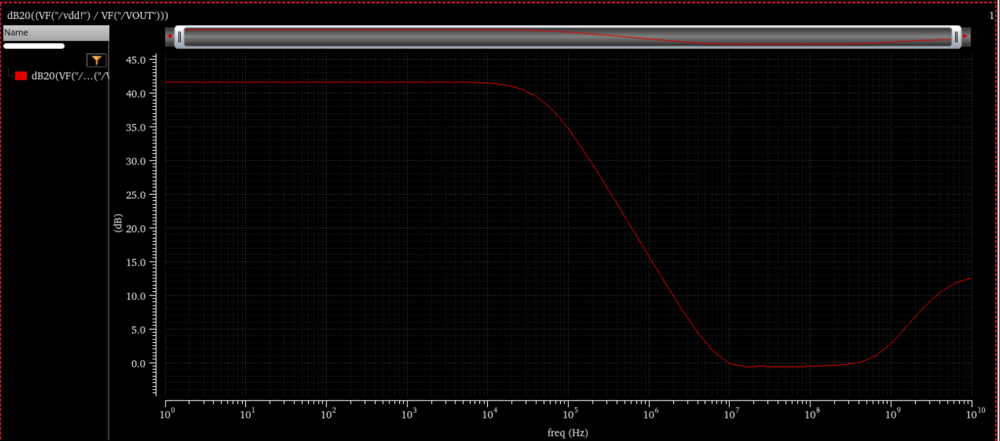
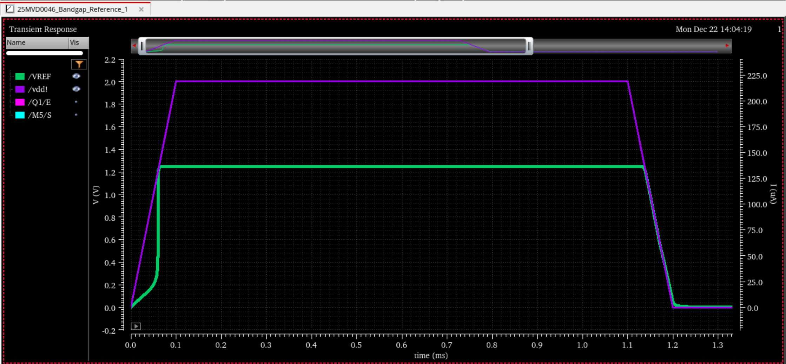

# Capless LDO & Bandgap Reference (180nm CMOS)

## 📌 Overview
This repository contains the design and simulation data for a fully integrated **Capless Low-Dropout (LDO) Regulator** and a **Curvature-Corrected Bandgap Reference (BGR)**.

Designed for System-on-Chip (SoC) applications where external capacitors are prohibitive, this LDO utilizes **Miller Compensation with a Nulling Resistor** to ensure unconditional stability across a **100x dynamic load range** (100µA to 10mA) without requiring a large output capacitor ($C_{load} \approx 4pF$).

## ⚡ Key Specifications

| Parameter | Value | Condition |
| :--- | :--- | :--- |
| **Technology** | 180nm | UMC180 CMOS |
| **Input Voltage ($V_{in}$)** | 1.8 V | Nominal |
| **Output Voltage ($V_{out}$)** | 1.6 V | Regulated |
| **Dropout Voltage** | < 100 mV | @ 10mA Full Load |
| **Max Load Current** | 10 mA | Industrial Standard |
| **Quiescent Current ($I_q$)** | ~400 µA | Optimized for Slew Rate |
| **Current Efficiency** | 97% | @ Full Load |
| **Phase Margin** | **67°** | @ Worst-Case (0.1mA) |
| **Load Regulation** | 0.8 mV/mA | 0.1mA to 10mA Step |
| **Line Regulation** | 10 mV/V | 1.7V to 2.0V Sweep |

## 🏗️ Architecture
### 1. Error Amplifier
A **Single-Stage Differential Amplifier with Current Mirror Load** was selected for its high DC gain and wide input common-mode range. The single-stage topology minimizes internal poles, simplifying the frequency compensation network required for the capless architecture.

### 2. Frequency Compensation
* **Problem:** In capless LDOs, the dominant pole shifts widely with load current ($R_{load}$), often leading to instability at light loads.
* **Solution:** Implemented **Miller Compensation ($C_c$)** with a **Nulling Resistor ($R_z$)**.
    * $C_c$ performs pole-splitting, locking the dominant pole at the Gate of the Pass Transistor.
    * $R_z$ pushes the Right-Half-Plane (RHP) Zero to high frequencies, preventing phase degradation.

### 3. Bandgap Reference
A self-biased, current-mode Bandgap Reference provides a temperature-independent 1.2V reference.
* **TC:** 25.9 ppm/°C (-40°C to 120°C).
* **Startup:** Robust startup circuit ensures no zero-current lockup.

## 📊 Simulation Results

### 1. Regulation Performance
**Line Regulation**
* Validated input voltage sweep from 1.4V to 2.0V.
* Output stabilizes at 1.6V with a dropout of ~70mV.

**Load Regulation**
* Output voltage deviation is minimal (<16mV) across the full load range.

---

### 2. Frequency Response (PSRR)
**Power Supply Rejection Ratio**
* **DC Rejection:** >42 dB.
* High-frequency rejection behavior is consistent with capless topology limitations.

*Best Case:*

*Worst Case:*

---

### 3. Transient Response
* **Load Step:** 0.1mA $\rightarrow$ 10mA (Rise time = 100ns)
* **Undershoot:** < 80 mV (<5% deviation)
* **Settling Time:** Fast recovery due to slew-rate optimized $I_q$.

---

### 4. Bandgap Reference (BGR) Results
**Output Voltage & Startup**
* Stable 1.2V output reference.
* Validated startup circuit performance to prevent latch-up.

